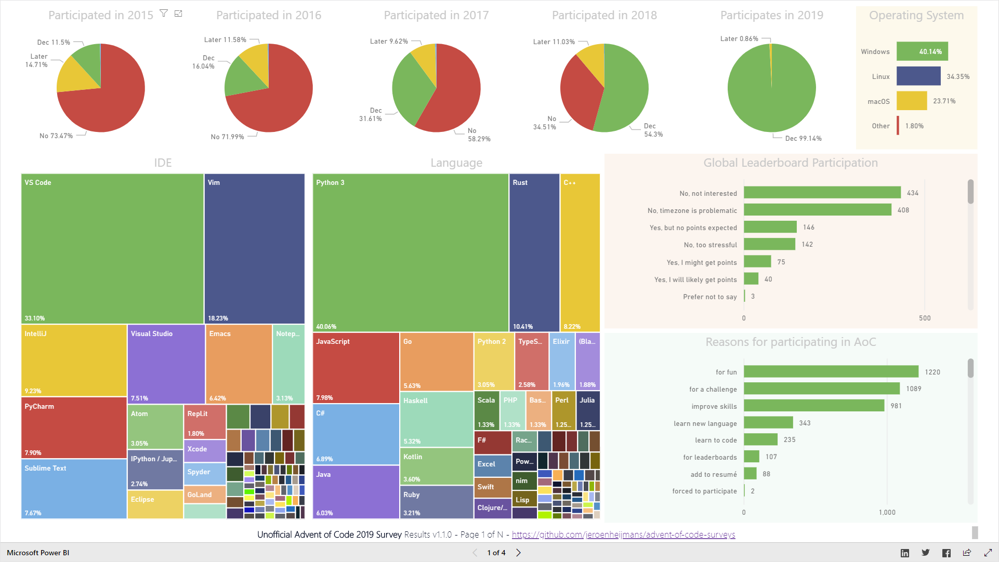
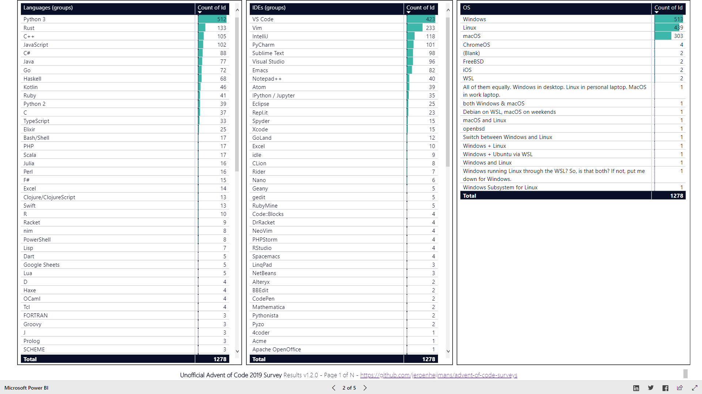
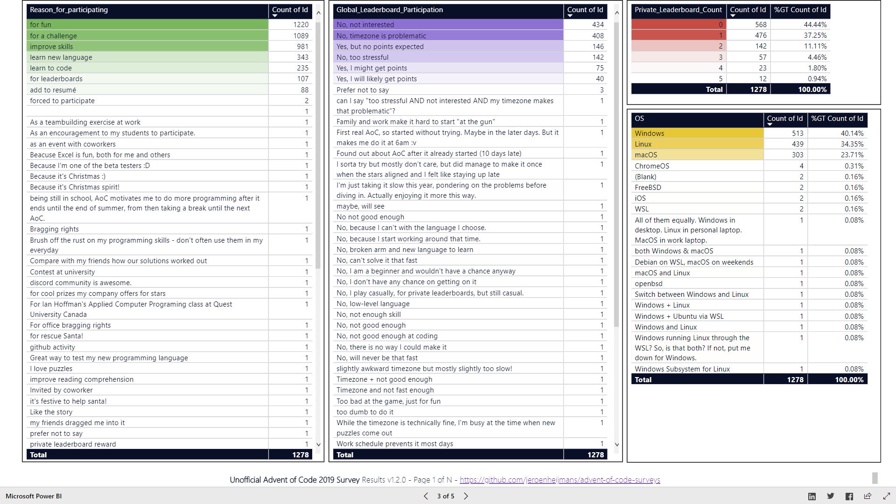
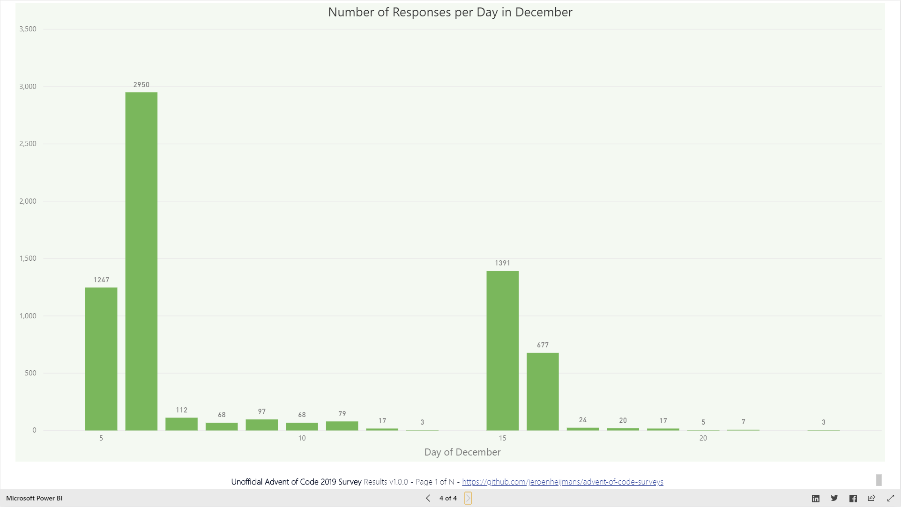

# The Unofficial Advent of Code 2019 Survey

This folder contains the results for the 2019 (unofficial) Advent of Code Survey.

## Data

The [results-sanitized.json](results-sanitized.json) file has all the data for you to play around with.
It was generated from the raw Google Forms CSV file by [csv-to-json.js](csv-to-json.js), which merely cleans up some of the data.

## Results

The results were published online as [a Power BI dashboard](https://app.powerbi.com/view?r=eyJrIjoiMzk1YjhmNTUtYWQ3Ny00MDE5LWE3ZDgtYzA5NTRjMGVhMWJhIiwidCI6IjQwOTEzYjA4LTQyZTYtNGMxOS05Y2FiLTRmOWZlM2U0YzJmZCIsImMiOjl9).
Given that this relies on a trial Power BI account, results will only be available through around end February 2020.
Below is a series of images with the same (though non-interactive) results.

