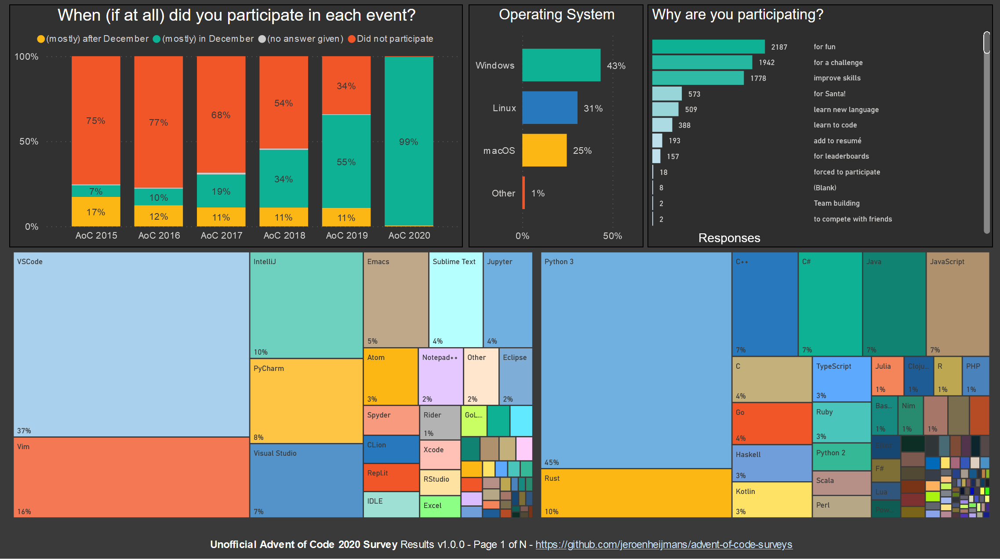
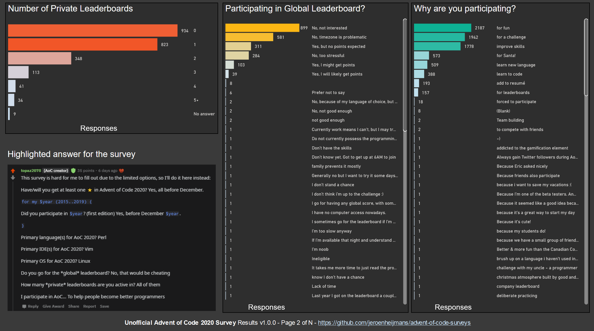
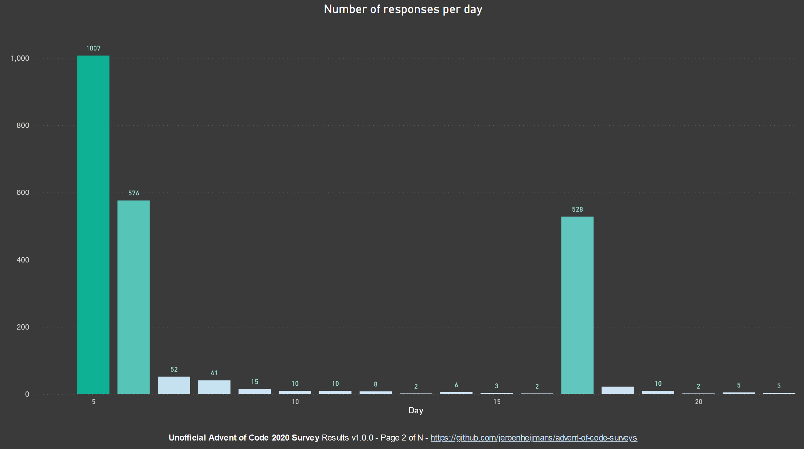
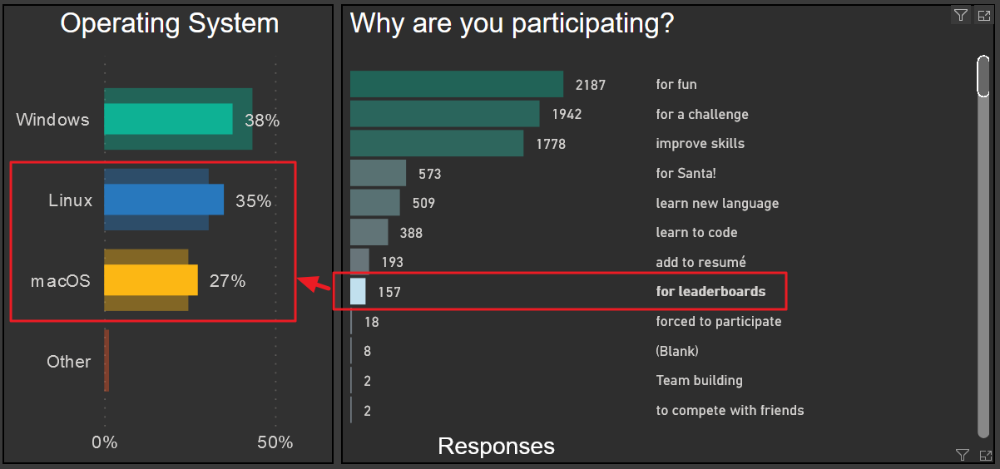
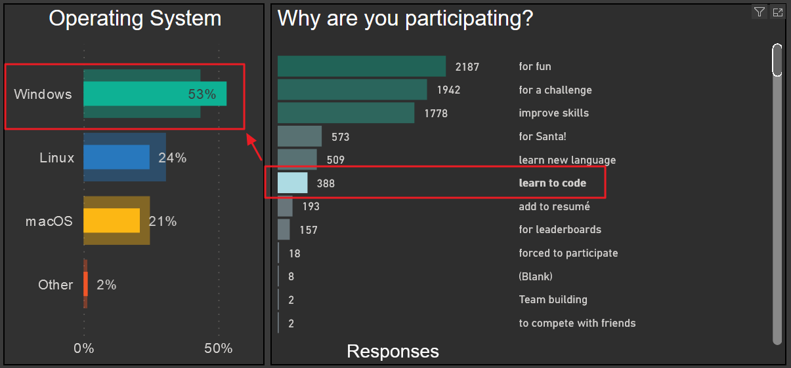
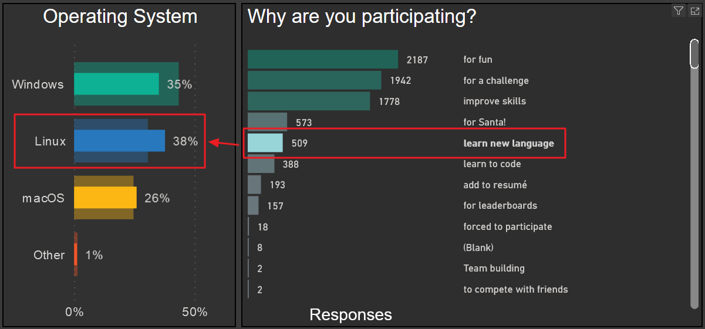

# The Unofficial Advent of Code 2020 Survey

This folder contains the results for the 2020 (unofficial) Advent of Code Survey.

## Data

The [results-sanitized.json](results-sanitized.json) file has all the data for you to play around with.
It was generated from the raw Google Forms CSV file by [csv-to-json.js](csv-to-json.js), which merely cleans up some of the data.

## Results

The results will be published online as a Power BI dashboard.
It is not guaranteed to stay up, given the account level I have for Power BI.
Below will be a series of images with the same (though non-interactive) results.

