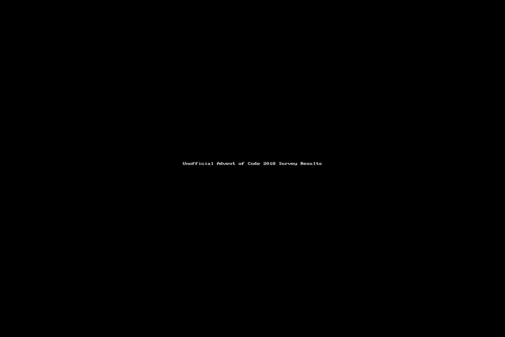

# The Unofficial Advent of Code Surveys

This repository contains the data and code around the (unofficial) Advent of Code survey, started in 2018.

## Editions

- 2015: No survey 😢
- 2016: No survey 😢
- 2017: No survey 😢
- 2018: [Survey Link](https://goo.gl/forms/9c8EvwY470vmIcO92), [Reddit Announcement (Dec 5)](https://www.reddit.com/r/adventofcode/comments/a3fknt/unofficial_aoc_2018_participant_survey/), [Reddit Reminder (Dec 18)](https://www.reddit.com/r/adventofcode/comments/a7abpp/reminder_unofficial_advent_of_code_survey_closes/), and [a Power BI dashboard (valid through around end of Feb 2018)](https://app.powerbi.com/view?r=eyJrIjoiYzRhODNlMWEtMWU4YS00MmE2LWIwNmMtYjg0MzMxMzlhMjEyIiwidCI6IjQwOTEzYjA4LTQyZTYtNGMxOS05Y2FiLTRmOWZlM2U0YzJmZCIsImMiOjl9)

## License and Affiliation Disclaimer

Note that "Advent of Code" and "AoC" are Eric Wastl's.
This project is not "official", and in no way (directly or indirectly) endorsed by- or affiliated to Advent of Code and its creator/owner.
Read more [about Advent of Code](https://adventofcode.com/2018/about) to learn about the project itself.

**Oh, and of course, please [consider donating to _Advent of Code_ itself](https://adventofcode.com/2018/support)!**

### This project

There are two parts to this project.
The code falls under the [MIT License](LICENSE_MIT.txt).
Data files (`*.json`, `*.csv`, and wherever otherwise explicitly noted) fall under the [Open Database License (ODbL) v1.0](LICENSE_ODBL.txt).

In addition to linked license files, Open Data Commons also has a [human-readable summary of the ODbL v1.0](https://opendatacommons.org/licenses/odbl/summary/index.html).

## Example

Here's an example of a dashboard created based on this data (2018 edition):

